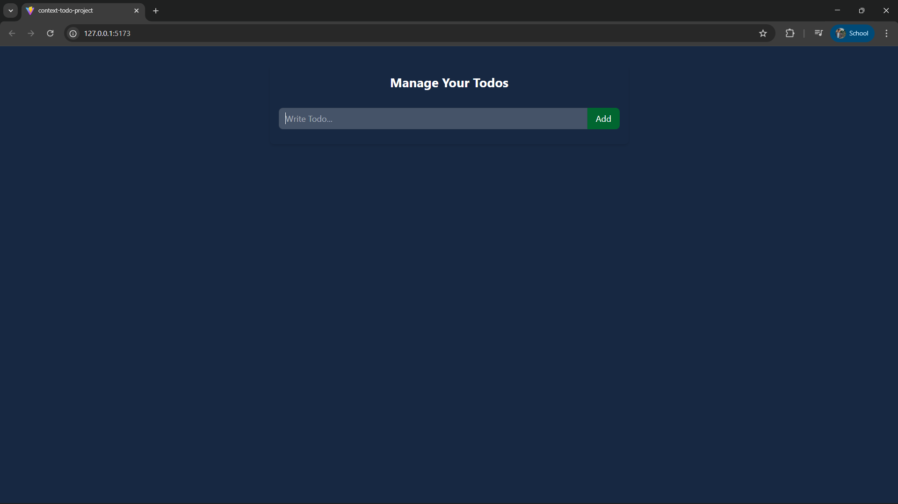
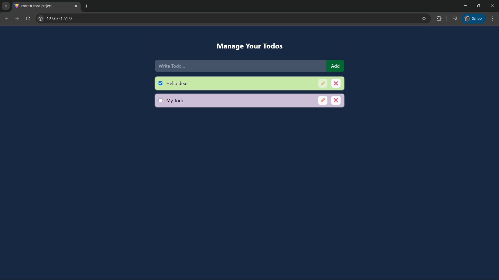

📝 React Todo App

A simple and clean React Todo Application built to practice state management, hooks and local storage.
Users can add, edit, delete and mark todos as complete — and all data stays even after refreshing!

🚀 Features

➕ Add new todos

✅ Mark todos as complete/incomplete

🗑️ Delete todos

✏️ Edit existing todos

💾 Saves todos in Local Storage

⚡ Built with React Hooks (useState, useEffect)

🛠️ Tech Stack

React.js

Vite

Tailwind CSS

📸 Screenshots

🧠 Learning Focus

This mini project helped me understand:

React state updates with useState

Data persistence using localStorage

Clean component structure

Managing lists dynamically